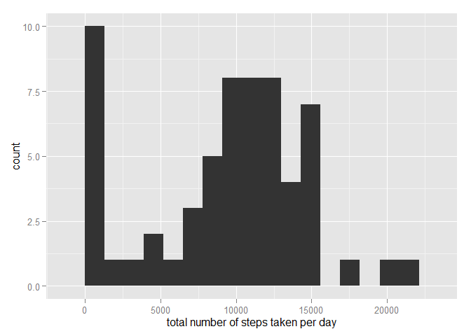
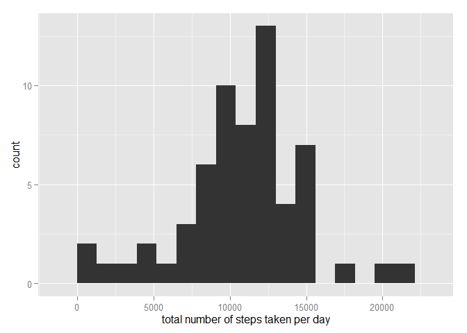
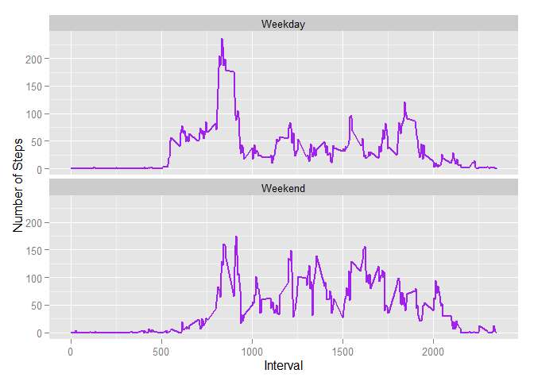

# Reproducible Research: Peer Assessment 1


## Loading and preprocessing the data


```r
setwd("D:/R/RepData_PeerAssessment1")
unzip(zipfile="activity.zip")

d1 <- read.csv("activity.csv", colClasses = c("numeric", "Date", "numeric"))

d1$day <- weekdays(d1$date)
library(ggplot2)
```


## What is mean total number of steps taken per day?
1. Making a histogram of the total number of steps taken each day


```r
steps <- tapply(d1$steps, d1$date, FUN=sum, na.rm=TRUE)
qplot(steps, binwidth=1300, xlab="total number of steps taken per day")
```

 


2.Calculate and report the mean and median of the total number of steps taken per day


```r
mean(steps, na.rm=TRUE)
```

```
## [1] 9354.23
```

```r
median(steps, na.rm=TRUE)
```

```
## [1] 10395
```

## What is the average daily activity pattern?
1. Make a time series plot (i.e. type = "l") of the 5-minute interval (x-axis) and the average number of steps taken, averaged across all days (y-axis)


```r
interval1 <- aggregate(steps ~ interval, data=d1, FUN=mean)
plot(interval1, type="l")
```

 

2. Which 5-minute interval, on average across all the days in the dataset, contains the maximum number of steps?


```r
interval1$interval[which.max(interval1$steps)]
```

```
## [1] 835
```

## Imputing missing values
1. The total number of missing values in the dataset.


```r
missing <- is.na(d1$steps)

table(missing)
```

```
## missing
## FALSE  TRUE 
## 15264  2304
```
2. The missing values are replaced by the mean number of steps for the 5 minutes interval of a NA value. The new data set is created.


```r
rep1 <- aggregate(steps ~ interval + day, d1, mean, na.rm = TRUE)
d2 <- merge(d1, rep1, by=c("interval", "day"))
d2 <- transform(d2, steps.x = ifelse(is.na(steps.x),steps.y,steps.x))
d2 <- data.frame(d2[,1:4])
names(d2) <- c("interval", "day","steps", "date")
d2$steps <- round(d2$steps, digits = 0)
d3 <- d2[order(d2$date, d2$interval),]
```

3. The new histogram


```r
steps2 <- tapply(d3$steps, d3$date, FUN=sum, na.rm=TRUE)
qplot(steps2, binwidth=1300, xlab="total number of steps taken per day")
```

 

4. The mean and median calulated on the new dataset


```r
mean(steps2, na.rm=TRUE)
```

```
## [1] 10821.1
```

```r
median(steps2, na.rm=TRUE)
```

```
## [1] 11015
```
The new values are higher then the previous ones.

## Are there differences in activity patterns between weekdays and weekends?
1. Create a new factor variable in the dataset with two levels - "weekday" and "weekend" indicating whether a given date is a weekday or weekend day.


```r
d3$daytype <- ifelse(d3$day %in% c("Saturday", "Sunday"),"Weekend", "Weekday")
d4 <- aggregate(steps ~ interval + daytype, d3, mean)
```

2. Make a panel plot containing a time series plot (i.e. type = "l") of the 5-minute interval (x-axis) and the average number of steps taken, averaged across all weekday days or weekend days (y-axis).


```r
ggplot(d4, aes(x=interval,y=steps)) + 
geom_line(color="purple",size=1) + 
facet_wrap(~daytype, nrow=2, ncol=1) + 
labs(x="Interval",y="Number of Steps") 
```

 
